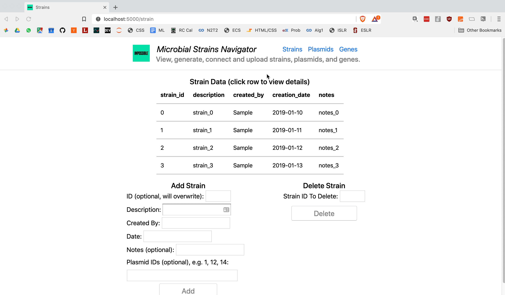
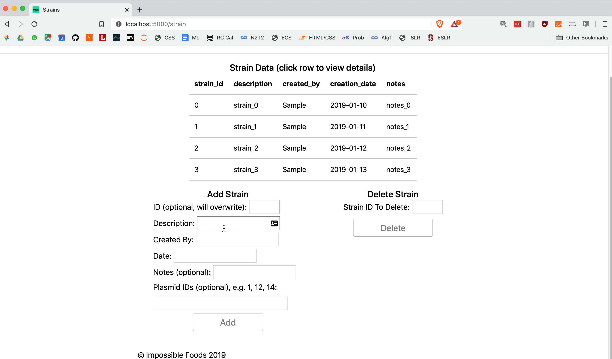
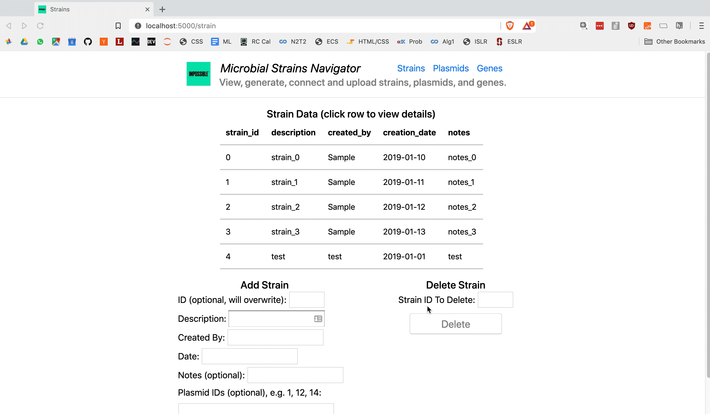
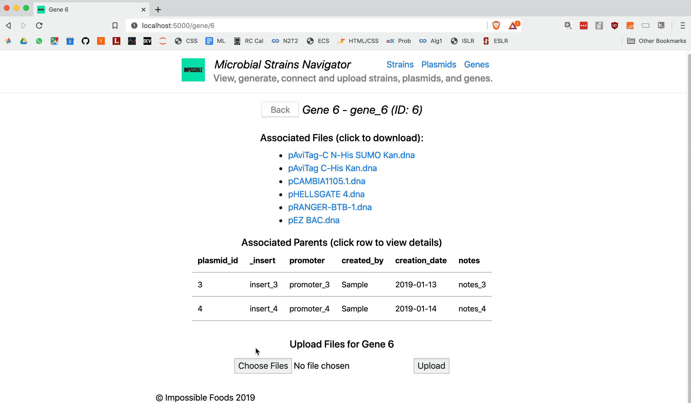

# Microbial Strain Navigator

***

This was a take home assignment I got in 2019 for Impossible Foods that I had a few days to complete.

#### Navigate and edit microbial strains, plasmids, and genes with a Flask web UI and MySQL database.

---

## Usage:

1. Viewing strains, plasmids, and genes
   
   

2. Adding elements
   
   

3. Deleting elements
   
   

4. Viewing details of a given element
   
   

5. Uploading and associating files with an element (multiple file upload is supported, but not shown here)
   
   

## Local Installation:

1) Install docker and docker-compose (cannot use Windows 7)
   
   * I used `Docker version 19.03.4, build 9013bf5` and `docker-compose version 1.24.1, build 4667896b`, but should work across other versions too

2) Clone this repo (`git clone https://github.com/robinovitch61/impossible_app.git`)

3) Navigate to the local version in a terminal and run the `start_app.sh` script.
   
   * **NOTE**: this script includes `docker system prune -f`, which [removes unused data](https://docs.docker.com/engine/reference/commandline/system_prune/). Comment this out if you'd like to keep your currently unused containers, images, and volumes.

4) Wait ~1min for startup. Then navigate to [http://localhost:5000/](http://localhost:5000/) and have a blast.
* If there are any startup issues, use `docker logs -f app` to view possible errors.

## Improvements/Next Steps:

- [ ] Remove `.secret.env` file from version control - there for demo purposes only right now

- [ ] Remove the debug mode/debugging from the app for production

- [ ] Improve code comments and add docstrings

- [ ] "Delete file" feature

- [ ] Fill Date Created field with current date by default and add time info if required

- [ ] Create cool top level graph visualization of all links/associations using graphviz or networkx and display as landing page

- [ ] Check file types to ensure safety (snapgene format only or something like that)

- [ ] Easier updating of elements (currently relies on overwriting with new element with same ID) - maybe edit tables directly and send UPDATE mysql queries on backend

- [ ] Possibly have X's next to table rows for easier deletion (although might make it too easy and mistakes could occur - include a confirmation box)

- [ ] Make the effects on the links/associations more explicit when an update/delete is made (currently clears all files and direct associations on an update)

- [ ] "Download All Files" button

- [ ] Fix bug with hover style on row turning off when hovers over text (detected as `mouseout` )

- [ ] Fix the small bugs that may exist from doing this relatively quickly

- [ ] If needed, scale up:
  
  - [ ] Put behind gunicorn for multiple workers on single machine
  
  - [ ] Use Kubernetes to distribute over multiple servers
